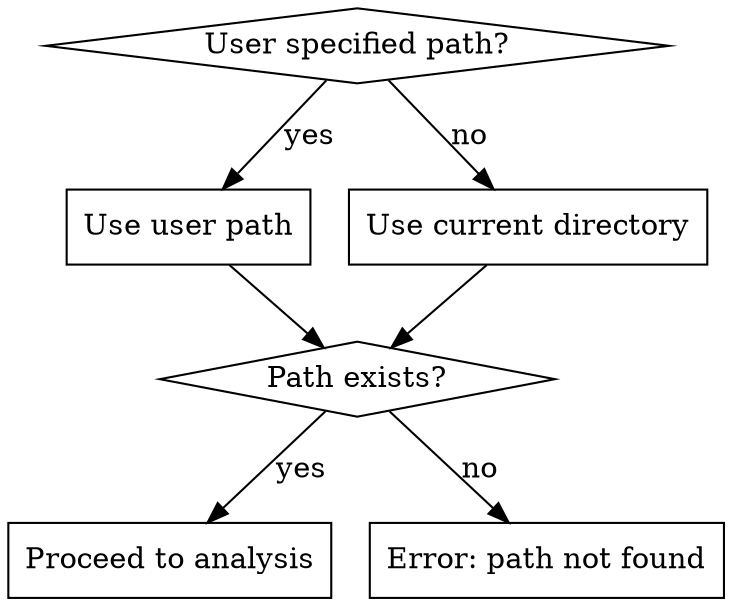
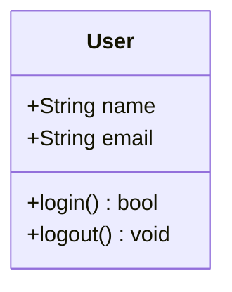
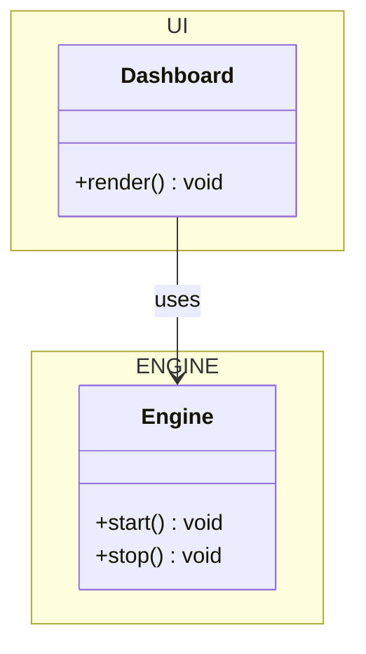
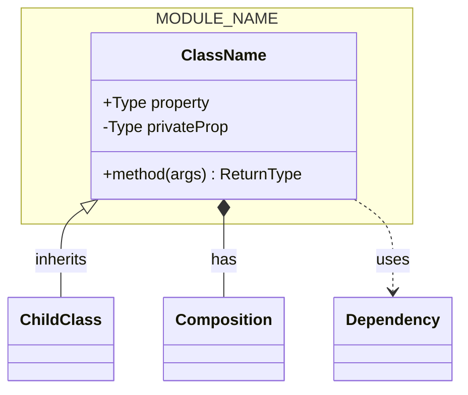

# Codebase Class Diagram Generator

Generate complete class diagrams depicting data structures and communication across an entire codebase.

## Overview

Creates Mermaid class diagrams showing:
- All meaningful data structures (classes, structs, interfaces, enums, types)
- Internal APIs and public variables
- Module JSON APIs and external interfaces
- Communication patterns between structures
- Semantic grouping into modules (ENGINE, UI, SERVICES, etc.)

## When to Use

- User asks for architecture overview or class diagram
- Need to visualize codebase structure across languages
- Documentation requires visual data structure representation
- Refactoring needs clear dependency visualization

## Process

### 1. Determine Target Path



### 2. Analyze Codebase

Use explore agents to scan for:

**Data Structures:**
- Classes (all methods, properties, constructors)
- Structs and records
- Interfaces and abstract types
- Enums and constants
- Type aliases and generics

**APIs:**
- Public methods and their signatures
- Internal module interfaces
- JSON API endpoints and schemas
- Event handlers and callbacks
- External library integrations

**Communication:**
- Inheritance hierarchies
- Composition relationships
- Dependencies (imports/requires)
- Event flows
- Data passing patterns

### 3. Categorize into Modules

Group semantically similar structures into logical modules. See [module-categorization.md](module-categorization.md) for grouping rules.

Common module categories:
- **ENGINE** - Core business logic, data processing
- **UI** - User interface components, views
- **SERVICES** - External integrations, APIs
- **DATA** - Database models, repositories
- **UTILS** - Helpers, shared utilities
- **CONFIG** - Configuration, settings

### 4. Generate Mermaid Diagram

Follow strict Mermaid syntax. See [mermaid-syntax-reference.md](mermaid-syntax-reference.md) for complete syntax guide.

**Output requirements:**
- Use `classDiagram` directive
- Organize by modules using namespaces
- Show all relationships (inheritance, composition, dependency)
- Include visibility modifiers (+, -, #, ~)
- Document methods and properties
- Use meaningful relationship labels

### 5. Request Output Path

Ask user for output path:
```
Where should the diagram be saved?
Example: ./docs/class-diagram.mmd
```

### 6. Validate and Render

```bash
# Install mermaid-cli if not present
npm install -g @mermaid-js/mermaid-cli

# Validate syntax (dry run)
mmdc -i <input.mmd> -o /dev/null

# Render to SVG
mmdc -i <input.mmd> -o <output.svg> -t default -b white
```

If validation fails:
1. Report specific syntax error
2. Fix the issue
3. Re-validate until successful

### 7. Present Results

Show user:
1. Absolute path to `.mmd` file
2. Absolute path to `.svg` file
3. Brief summary of what's included

## Quick Reference

| Action | Command |
|--------|---------|
| Validate Mermaid | `mmdc -i file.mmd -o /dev/null` |
| Render SVG | `mmdc -i file.mmd -o file.svg -t default -b white` |
| Install CLI | `npm install -g @mermaid-js/mermaid-cli` |

## Common Mistakes

1. **Missing semicolons** - Each property/method needs `;`
2. **Invalid visibility** - Use only `+`, `-`, `#`, `~`
3. **Broken relationships** - Check arrow syntax: `|--`, `*--`, `o--`, `-->`
4. **Namespace errors** - Use `namespace ModuleName { }` blocks
5. **Special characters** - Escape quotes with `\"`

## Examples

### Simple Class



### With Module



### Complete Diagram Structure


