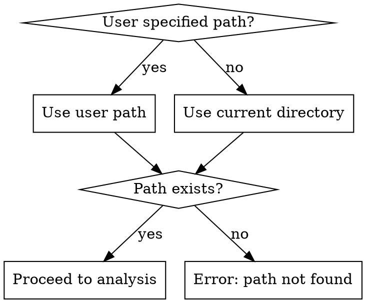
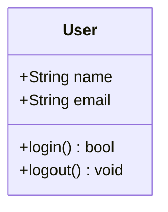
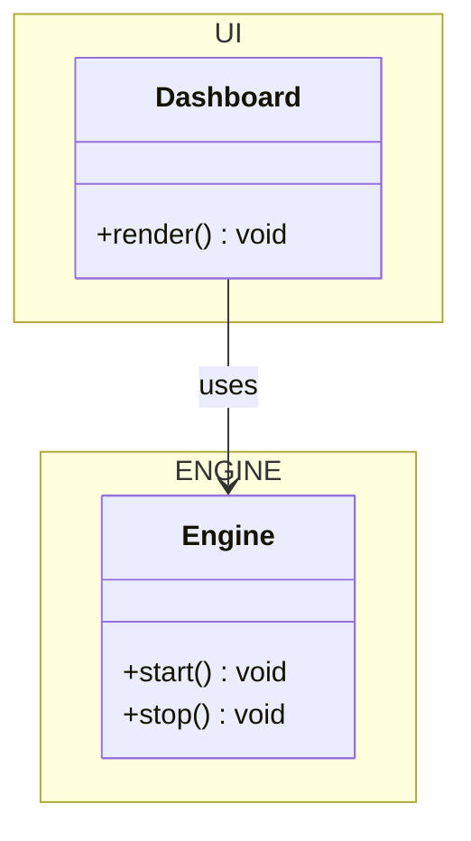
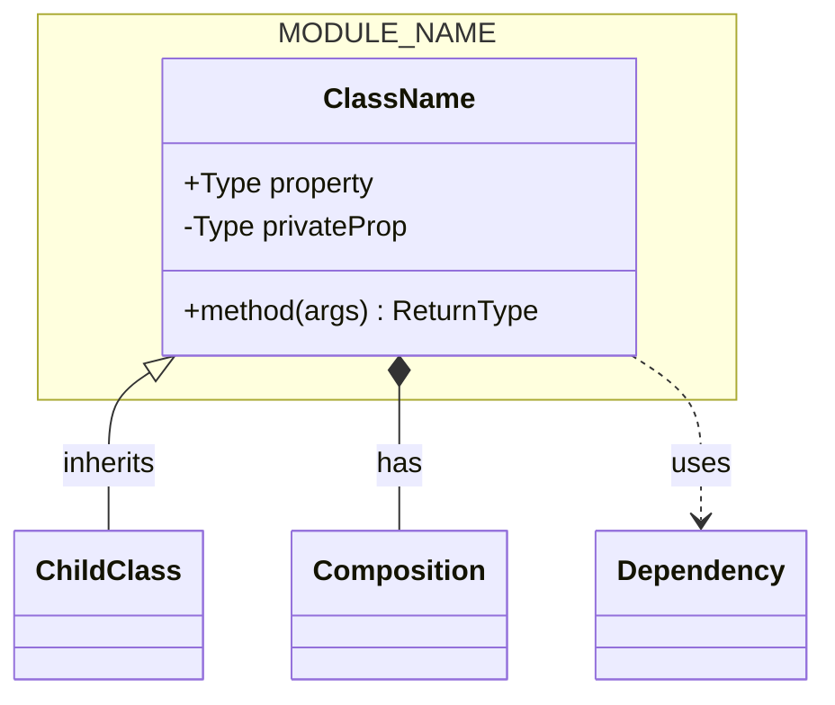

# Codebase Class Diagram Generator

Generate complete Mermaid class diagrams depicting data structures and communication across an entire codebase.

## Overview

Creates Mermaid class diagrams showing:
- All meaningful data structures (classes, structs, interfaces, enums, types)
- Internal APIs and public variables
- Module JSON APIs and external interfaces
- Communication patterns between structures
- Semantic grouping into modules

## Gotchas (Read First)

### Mermaid-Specific
- **Generic syntax uses tildes**: `List~String~` NOT `List<String>` — angle brackets break parsing
- **Semicolons required**: Every property/method line must end with `;`
- **Class names must be unique** across the entire diagram
- **Relationships after classes**: Define all classes first, then relationships
- **Escape quotes**: Use `\"` for quotes in notes

### Language-Specific
- **Python decorators** (`@staticmethod`): Map to stereotypes `<<static>>`, `<<property>>`
- **Java annotations** (`@Override`): Map to stereotypes `<<override>>`, `<<serializable>>`
- **TypeScript generics**: Show type parameters: `+fetch~T~() Response~T~`
- **TypeScript interfaces**: Use `<<interface>>` stereotype, dashed realization `..|>`
- **Python dataclasses/Pydantic**: Treat as regular classes, extract field types from annotations

### Diagram Size
- **Hard limit**: Mermaid struggles beyond ~30 nodes (overlapping, poor layout)
- **Split strategy**: One diagram per bounded context/module (15-25 classes max)
- **Filter by default**: Show only public API, hide internal implementations

### Noise Filtering
- **Exclude**: Test files, auto-generated code (protobuf, OpenAPI stubs, ORM models)
- **Exclude**: Boilerplate (getters/setters, `__init__` with only `self.x = x`)
- **Exclude**: Single-function modules, string constants, config values
- **Include**: Public API surface, class relationships, interface contracts, abstract classes

## Process

### 1. Determine Target Path



### 2. Detect Languages

Scan file extensions to determine languages present:
- `.py` → Python
- `.java` → Java
- `.ts`, `.tsx` → TypeScript
- `.cs` → C#
- `.go` → Go
- `.rs` → Rust
- `.cpp`, `.h` → C++

Use appropriate parsers for each language.

### 3. Analyze Codebase (Multi-Pass)

**Pass 1 — File Identification:**
- Identify source files (exclude tests, generated code)
- Determine dependency weight (files imported by many others = more significant)

**Pass 2 — Structure Extraction:**
- Classes, structs, records
- Interfaces and abstract types
- Enums and constants
- Type aliases and generics

**Pass 3 — Member Extraction:**
- Public methods and signatures
- Internal module interfaces
- Event handlers and callbacks

**Pass 4 — Relationship Mapping:**
- Inheritance hierarchies (`<|--`)
- Composition relationships (`*--`)
- Aggregation (`o--`)
- Dependencies (`..>`)
- Interface implementation (`..|>`)

**Pass 5 — Semantic Analysis:**
- Group into logical modules (ENGINE, UI, SERVICES, etc.)
- Determine architectural significance

### 4. Categorize into Modules

Group semantically similar structures into logical modules. See [module-categorization.md](module-categorization.md) for grouping rules.

### 5. Generate Mermaid Diagram

Follow strict Mermaid syntax. See [mermaid-syntax-reference.md](mermaid-syntax-reference.md) for complete syntax guide.

**Relationship Types:**
| Syntax | UML Type | Use When |
|--------|----------|----------|
| `<|--` | Inheritance | `Car` is-a `Vehicle` |
| `*--` | Composition | `Order` owns `OrderItem` (part dies with whole) |
| `o--` | Aggregation | `Team` has `Player` (player exists independently) |
| `-->` | Association | `User` uses `Service` (structural, long-lived) |
| `--` | Link (solid) | Generic relationship when type is ambiguous |
| `..>` | Dependency | `Controller` depends-on `Repository` (transient/weak) |
| `..|>` | Realization | `ServiceImpl` implements `<<interface>> Service` |
| `..` | Link (dashed) | Generic weak relationship |

**Output requirements:**
- Use `classDiagram` directive
- Organize by modules using namespaces
- Show all applicable relationships with meaningful labels
- Include visibility modifiers (+, -, #, ~)
- Document methods and properties
- Add cardinality ("1", "*", "0..1") where count matters

### 6. Request Output Path

Ask user for output path:
```
Where should the diagram be saved?
Example: ./docs/class-diagram.mmd
```

### 7. Validate and Render

```bash
# Install mermaid-cli if not present
npm install -g @mermaid-js/mermaid-cli

# Validate syntax (dry run)
mmdc -i <input.mmd> -o /dev/null

# Render to SVG
mmdc -i <input.mmd> -o <output.svg> -t default -b white
```

If validation fails:
1. Report specific syntax error
2. Fix the issue
3. Re-validate until successful

### 8. Present Results

Show user:
1. Absolute path to `.mmd` file
2. Absolute path to `.svg` file
3. Brief summary of what's included
4. Any limitations (diagram size, filtered content)

## Quick Reference

| Action | Command |
|--------|---------|
| Validate Mermaid | `mmdc -i file.mmd -o /dev/null` |
| Render SVG | `mmdc -i file.mmd -o file.svg -t default -b white` |
| Install CLI | `npm install -g @mermaid-js/mermaid-cli` |

## Examples

### Simple Class



### With Module



### Complete Diagram Structure


