# Mermaid Class Diagram Syntax Reference

## Basic Structure

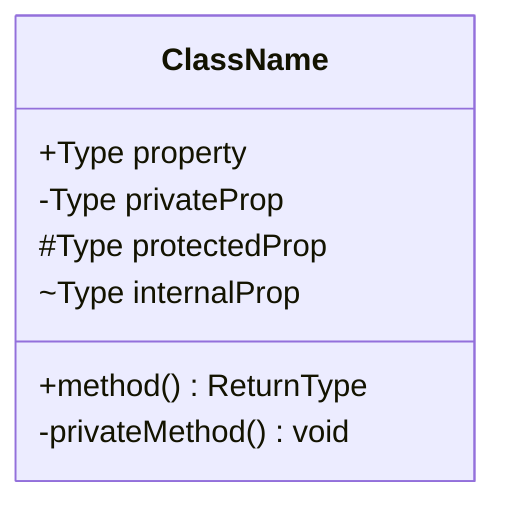

## Visibility Modifiers

| Symbol | Meaning |
|--------|---------|
| `+` | Public |
| `-` | Private |
| `#` | Protected |
| `~` | Package/Internal |

## Naming Conventions

| Element | Convention | Example |
|---------|-----------|---------|
| Class names | **PascalCase**, singular | `UserService`, `OrderItem` |
| Class IDs | alphanumeric + `_`/`-` only | `UserService`, `order-item` |
| Attributes | **camelCase** with type prefix | `+String email`, `-int count` |
| Methods | **camelCase** with parens | `+login()`, `+findById(id String)` |
| Relationship labels | **lowercase verb phrases** | `: places`, `: manages` |
| Annotations | `<<PascalCase>>` | `<<Interface>>`, `<<Abstract>>` |
| Generics | **tilde** not angle brackets | `+list~String~ items` (NOT `<String>`) |

## Data Types

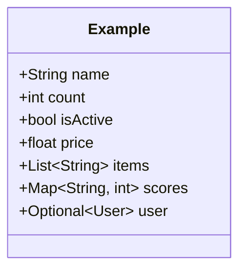

## Methods with Parameters

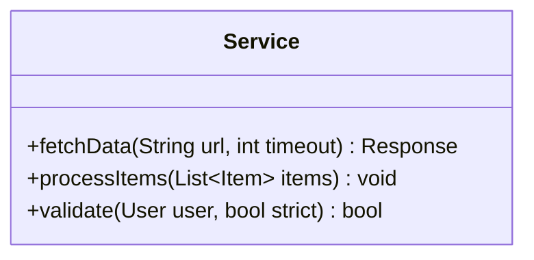

## Relationships

### All 8 Relationship Types

| Syntax | UML Type | Use When |
|--------|----------|----------|
| `<|--` | **Inheritance** (Generalization) | `Car` is-a `Vehicle` |
| `*--` | **Composition** | `Order` owns `OrderItem` (part dies with whole) |
| `o--` | **Aggregation** | `Team` has `Player` (player exists independently) |
| `-->` | **Association** | `User` uses `Service` (structural, long-lived) |
| `--` | **Link (solid)** | Generic relationship when type is ambiguous |
| `..>` | **Dependency** | `Controller` depends-on `Repository` (transient/weak) |
| `..|>` | **Realization** | `ServiceImpl` implements `<<interface>> Service` |
| `..` | **Link (dashed)** | Generic weak relationship |

### Inheritance (Generalization)
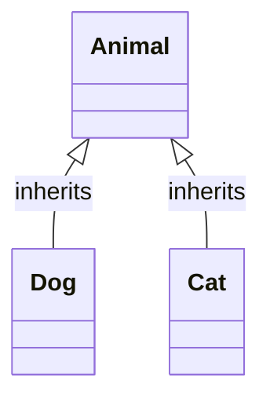

### Composition (Strong ownership)
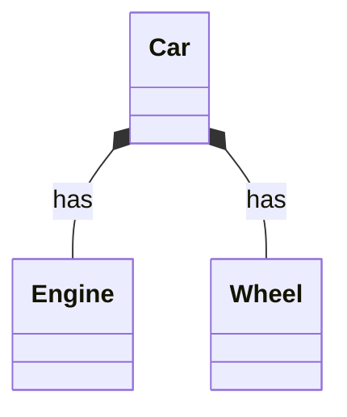

### Aggregation (Weak ownership)
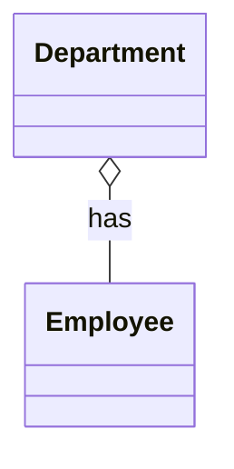

### Association (Relationship)
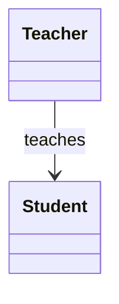

### Dependency (Uses)
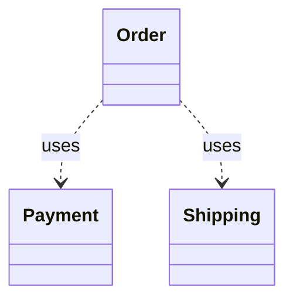

### Realization (Interface implementation)
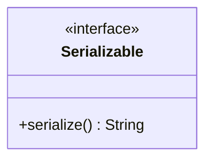

## Cardinality

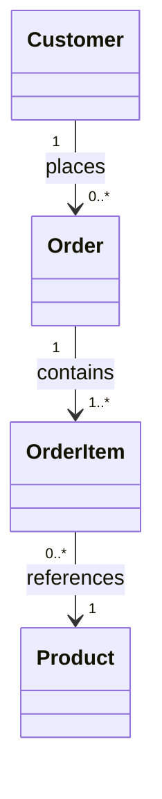

Cardinality labels: `"1"`, `"*"`, `"0..1"`, `"1..*"`, `"0..*"`

## Annotations

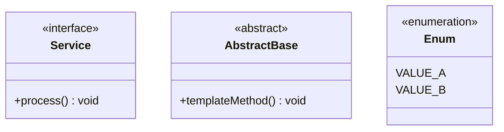

## Namespaces (Modules)

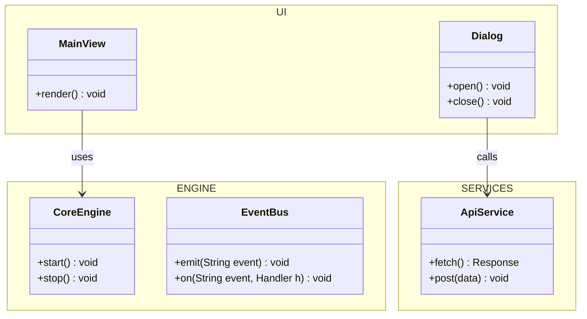

Hierarchical namespaces with dot notation: `namespace A.B.C`

## Notes

```mermaid
classDiagram
    class User {
        +String id
    }
    note "This is a user"
    note for User "Represents system user"
    note right of User "User entity"
```

## Diagram Size Management

### When to Split
- **>20-30 classes**: Mermaid's dagre layout struggles (overlapping, poor spacing)
- Split by bounded context, module, or domain area

### Split Strategy
```
docs/diagrams/
├── domain-users.mmd
├── domain-orders.mmd
├── domain-payments.mmd
└── infrastructure.mmd
```

### Hiding Members
When full detail isn't needed, hide empty members box in config.

## Complete Example

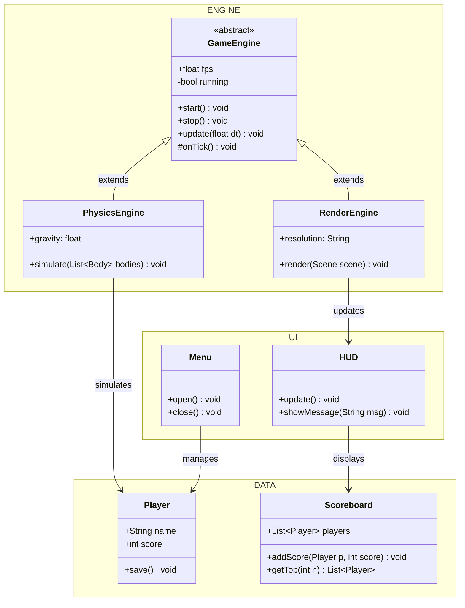

## Syntax Rules

1. **Semicolons required** - Every property/method line ends with `;`
2. **Relationships after classes** - Define all classes first, then relationships
3. **No duplicate names** - Each class name must be unique
4. **Escape special chars** - Use `\"` for quotes in notes
5. **Generic syntax** - Use `~` for generics: `List~String~`
6. **Namespace blocks** - Use `namespace Name { }` with proper braces
7. **Quote special characters** - Always quote labels with special characters: `["Label with (parens)"]`
8. **Avoid reserved words** - Don't use `end`, `default`, `style` as node IDs (or quote them)
