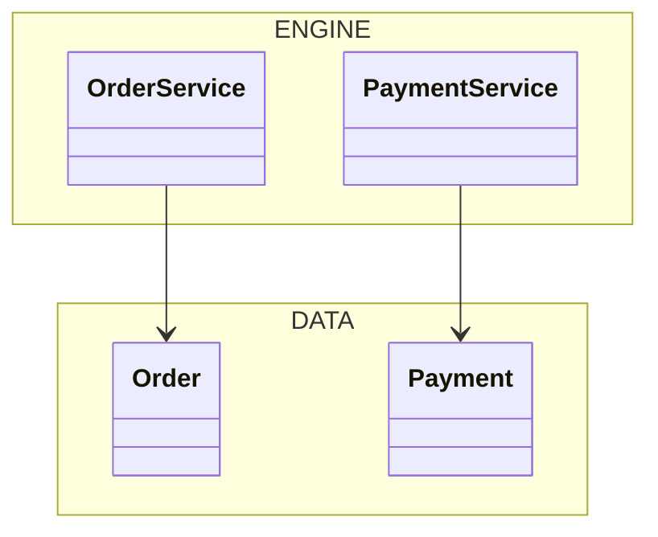
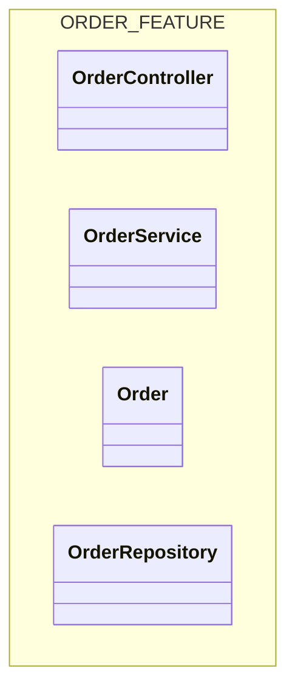
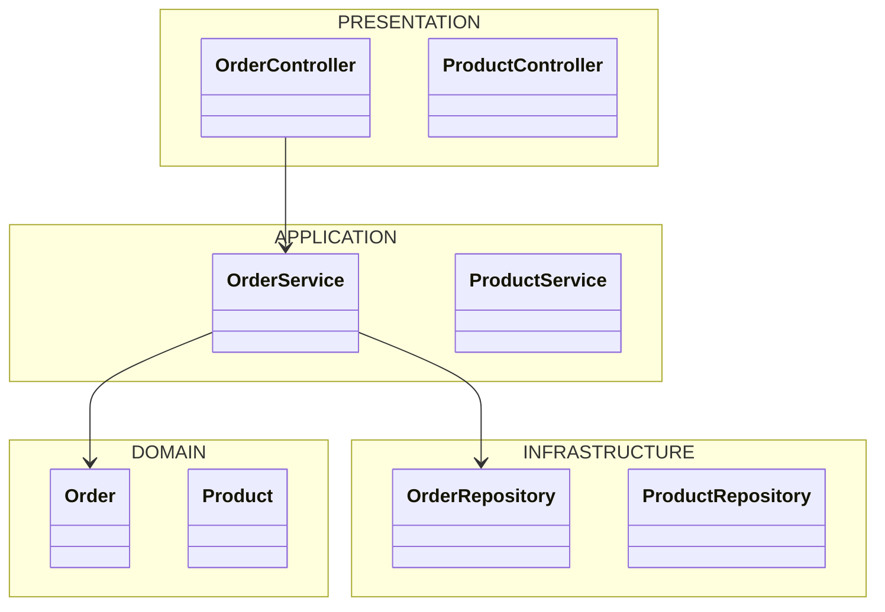

# Module Categorization Guide

## Purpose

Group semantically similar code structures into logical modules for diagram organization.

## Standard Module Categories

| Module | Purpose | Examples |
|--------|---------|----------|
| **ENGINE** | Core business logic, data processing | Domain services, algorithms, validators, core entities |
| **UI** | User interface components | Views, components, widgets, controllers, presenters |
| **SERVICES** | External integrations, APIs | API clients, database connectors, message queue handlers |
| **DATA** | Database models, repositories | Entities, models, DAOs, repositories, migrations |
| **UTILS** | Helpers, shared utilities | String helpers, date formatters, validators, constants |
| **CONFIG** | Configuration, settings | Config classes, environment handlers, options |
| **INFRA** | Infrastructure concerns | Logging, caching, authentication, middleware |

## Categorization Rules

### 1. Primary Responsibility Test

Ask: **What is this class's single primary responsibility?**

- If it **processes business rules** → ENGINE
- If it **renders UI** → UI
- If it **communicates with external systems** → SERVICES
- If it **represents persistent data** → DATA
- If it **provides reusable functions** → UTILS
- If it **manages configuration** → CONFIG
- If it **handles cross-cutting concerns** → INFRA

### 2. Dependency Direction

```
UI → ENGINE → SERVICES
  ↘   ↓   ↙
    DATA
      ↓
    UTILS
```

- **UI** depends on ENGINE (not reverse)
- **ENGINE** depends on DATA and SERVICES (not UI)
- **DATA** depends on UTILS (not ENGINE)
- **UTILS** depends on nothing (pure functions)

### 3. Naming Clues

| Prefix/Suffix | Likely Module |
|---------------|---------------|
| `*Service`, `*Handler`, `*Processor` | ENGINE or SERVICES |
| `*Controller`, `*View`, `*Component`, `*Page` | UI |
| `*Repository`, `*Dao`, `*Model`, `*Entity` | DATA |
| `*Helper`, `*Util`, `*Utils`, `*Formatter` | UTILS |
| `*Config`, `*Settings`, `*Options` | CONFIG |
| `*Logger`, `*Cache`, `*Auth`, `*Middleware` | INFRA |

### 4. File Location Clues

| Directory | Likely Module |
|-----------|---------------|
| `src/core/`, `src/domain/`, `src/business/` | ENGINE |
| `src/ui/`, `src/views/`, `src/components/` | UI |
| `src/services/`, `src/api/`, `src/clients/` | SERVICES |
| `src/models/`, `src/entities/`, `src/repos/` | DATA |
| `src/utils/`, `src/helpers/`, `src/shared/` | UTILS |
| `src/config/`, `src/settings/` | CONFIG |
| `src/infra/`, `src/middleware/`, `src/logging/` | INFRA |

## Custom Modules

If the codebase has domain-specific groupings, create custom modules:

| Domain | Custom Modules |
|--------|----------------|
| E-commerce | CATALOG, CART, CHECKOUT, PAYMENT, SHIPPING |
| Social | FEED, MESSAGING, PROFILE, NOTIFICATION |
| Gaming | PLAYER, WORLD, PHYSICS, RENDERING, INPUT |
| Finance | ACCOUNT, TRANSACTION, LEDGER, REPORTING |

## Diagram Organization

### Option 1: By Module


### Option 2: By Feature/Domain


### Option 3: Layered (Recommended for Large Codebases)


## Filtering by Module

When generating diagrams, ask the user:
1. Which modules to include?
2. What level of detail? (public API only vs full implementation)
3. Maximum number of classes per diagram?
